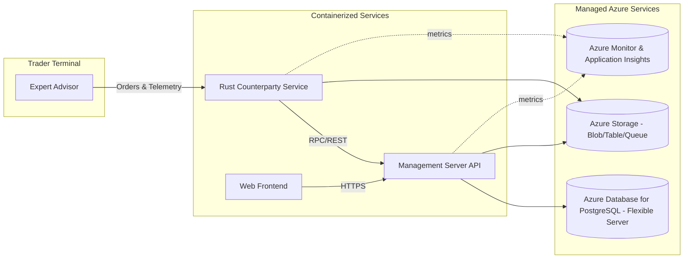

# Kopitra Copy Trading Platform

## Overview
Kopitra enables copy trading by synchronizing positions from a master trader to follower portfolios. The development scope for this repository is limited to four deliverables that form the core runtime:

1. **Expert Advisor (EA)** that runs on the trader's terminal and emits trade signals plus telemetry.
2. **Rust Counterparty Service** that terminates EA requests, validates payloads, and forwards executable orders.
3. **Management Server API** that provides authenticated configuration and monitoring endpoints for operators.
4. **Web Frontend** that surfaces administrative workflows, dashboards, and operational tooling.

The objective is to build these components with a cost-efficient footprint while relying on managed storage so that operational overhead remains low.

## Architecture Blueprint
The following topology keeps containerized workloads lightweight while delegating data persistence to managed services.



### Component Responsibilities
- **Expert Advisor** – Publishes trade intentions, receives execution callbacks, and handles retry logic with idempotency keys.
- **Rust Counterparty Service** – Offers low-latency ingestion of EA messages, normalizes broker payloads, and enforces the required request headers.
- **Management Server API** – Hosts secure configuration endpoints, audit reporting, and task automation for operators.
- **Web Frontend** – Provides dashboards to observe synchronization health, manage accounts, and trigger administrative actions.

## Managed Storage Strategy
To comply with the requirement that all persistent data uses managed storage, the baseline stack is:

| Use Case | Service | Notes |
|----------|---------|-------|
| Relational data (accounts, trade history, configuration) | **Azure Database for PostgreSQL Flexible Server** | Serverless tier auto-pauses when idle, reducing runtime spend while preserving high availability options. |
| File and report artifacts | **Azure Blob Storage** | Stores EA logs, generated reports, and downloadable audit bundles with lifecycle policies for cold storage. |
| Queues and background workflows | **Azure Queue Storage** (or Service Bus Basic if ordering guarantees are required) | Managed messaging ensures EA retries and operational tasks do not require bespoke brokers. |
| Caching and transient state | **Azure Cache for Redis (Basic tier)** | Optional component for accelerating dashboard reads; can be paused in lower environments. |

## Cost-Optimized Deployment Plan
The platform favours approaches that avoid recurring spend until workloads are active, while still allowing an AKS-based deployment if costs stay near USD 50 per month.

### Local & Developer Environments
- Use Docker Compose or Podman to run the Rust service, management API, and frontend locally. Bind the EA to the local stack through secure tunnels when required.
- For data stores, connect to Azure-managed instances provisioned in a dev resource group; enable serverless auto-pause so that inactive periods incur minimal cost.
- Developers can fall back to containerized emulators (Azurite, PostgreSQL) for offline work, but production-equivalent testing should target managed resources.

### Shared Development / Staging
- Deploy all services to a **single-node AKS cluster** on a burstable B-series VM (e.g., B4ms) with cluster auto-stop scripts. With spot pricing and nightly shutdown, monthly spend stays near the USD 50 threshold.
- Alternatively, use **Azure Container Apps** for the Rust service, management API, and frontend when compute demand is low; scale to zero keeps idle costs negligible.
- Continuous integration publishes container images to Azure Container Registry (ACR) and rolls them out via GitHub Actions workflows.

### Production Considerations
- Scale AKS to multiple nodes only when live trading volume requires redundancy; otherwise keep a minimal node pool with horizontal pod autoscaling.
- Enable Azure Monitor alerts on EA connectivity, order latency, and API failures; route incidents through PagerDuty or Teams.
- Configure backup policies for PostgreSQL and Blob Storage with geo-redundant replication to satisfy compliance needs.

## API Surface & Data Flows
The Rust counterparty service and management API collaborate to process trades and expose operational controls.

| Method | Path | Component | Description |
|--------|------|-----------|-------------|
| `POST` | `/trade-agent/v1/signals` | Rust Counterparty Service | Receive EA trade intents; validate headers and forward to execution pipeline. |
| `POST` | `/trade-agent/v1/executions` | Rust Counterparty Service | Record broker execution callbacks with idempotent handling. |
| `GET` | `/trade-agent/v1/health` | Rust Counterparty Service | Publish readiness checks covering downstream dependencies. |
| `GET` | `/admin/v1/accounts` | Management Server API | List managed accounts, entitlements, and linked brokers. |
| `POST` | `/admin/v1/tasks/{taskId}/run` | Management Server API | Trigger operational automations (e.g., resync follower). |
| `GET` | `/admin/v1/audit/runs/{runId}` | Management Server API | Retrieve full execution trace for compliance review. |

WebSocket or SignalR hubs can supplement the HTTP API for live dashboard updates without maintaining custom socket servers.

## Development Workflow
1. **Clone the Repository**
   ```bash
   git clone git@github.com:kopitra/platform.git
   cd platform
   ```
2. **Bootstrap Environment Variables**
   - Copy `.env.sample` files for the Rust service, management API, and frontend. Populate broker credentials, managed storage connection strings, and EA authentication secrets.
   - Store secrets in Azure Key Vault and access them locally via `az keyvault secret show` to avoid plaintext storage.
3. **Install Tooling**
   - Docker or Podman, Rust toolchain (`rustup`), .NET 8 SDK, Node.js 18+, Azure CLI, and Terraform/Bicep for infrastructure changes.
4. **Run Services Locally**
   ```bash
   docker compose up rust-gateway admin-api web-frontend
   # Launch the EA within its trading terminal and point it to http://localhost:8080
   ```
5. **Execute Tests & Linters**
   - Rust gateway:
     ```bash
     cd gateway
     cargo fmt --all
     cargo clippy --all-targets --all-features -- -D warnings
     cargo build --all-targets --locked
     cargo test --all --locked
     ```
   - .NET management API (Azure Functions):
     ```bash
     cd functions
     dotnet restore Functions.sln
     dotnet format Functions.sln --verify-no-changes --verbosity minimal
     dotnet build Functions.sln --no-restore
     dotnet test Functions.sln --no-build
     ```
   - Web frontend:
     ```bash
     cd opsconsole
     npm install
     npm run lint
     npm test
     npm run build
     ```
6. **Deploy Infrastructure (Optional)**
   ```bash
   az login
   az account set --subscription <subscription-id>
   az deployment sub create \
     --location japaneast \
     --template-file infra/main.bicep \
     --parameters env=dev acrName=<acr-name> aksSku=basic
   ```

## Monitoring & Operations
- **Logging** – Emit structured JSON logs to Azure Monitor; configure Log Analytics workspaces with cost caps and retention policies aligned to compliance SLAs.
- **Metrics** – Track signal ingestion latency, EA uptime, and order reconciliation success. Set thresholds for proactive paging.
- **Runbooks** – Document EA failover, AKS node recovery, and managed storage restoration procedures. Store runbooks alongside infrastructure-as-code for version control.

## Roadmap Highlights
- Harden EA connectivity with circuit breakers and offline buffering.
- Automate cost anomaly detection using Azure Cost Management alerts.
- Expand broker integrations incrementally, gating each behind feature flags in the management API.

## References
- [Azure Kubernetes Service Documentation](https://learn.microsoft.com/azure/aks/)
- [Azure Database for PostgreSQL Flexible Server](https://learn.microsoft.com/azure/postgresql/flexible-server/overview)
- [Azure Container Apps Documentation](https://learn.microsoft.com/azure/container-apps/)
- [Azure Storage Overview](https://learn.microsoft.com/azure/storage/common/storage-introduction)
