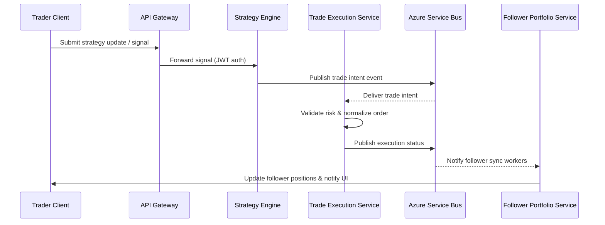

# Kopitra Copy Trading Platform

## Overview
Kopitra is a cloud-native copy trading platform that synchronizes trading strategies across client portfolios in real time. The system spans client applications, an API gateway, orchestration microservices, analytics, and a resilient deployment on Azure Kubernetes Service (AKS). This README consolidates the planned architecture, describes how the components collaborate, enumerates the major API endpoints, and captures deployment guidance for engineering and DevOps teams.

## High-Level Architecture
The platform is organized around three primary domains: client-facing applications, the gateway and orchestration layer, and the managed services hosted in Azure. The diagram below outlines the topology and traffic flow.

```mermaid
flowchart LR
    subgraph Clients
        Web[Web Client]
        Mobile[Mobile Client]
    end

    subgraph Gateway[API Gateway Layer]
        APIM[Azure API Management]
    end

    subgraph Azure[Azure Services]
        AKS[Kubernetes Services (AKS)]
        SB[(Azure Service Bus)]
        SQL[(Azure SQL Database)]
        Cosmos[(Azure Cosmos DB)]
        Redis[(Azure Cache for Redis)]
        KeyVault[(Azure Key Vault)]
        Monitor[Azure Monitor & Application Insights]
    end

    Web & Mobile -->|HTTPS/REST| APIM
    APIM -->|Routing & Auth| AKS
    AKS --> SB
    AKS --> SQL
    AKS --> Cosmos
    AKS --> Redis
    AKS --> KeyVault
    AKS -.-> Monitor
    APIM -.logs.-> Monitor
```

### Core Services Deployed to AKS
- **Identity & Session Service** – Handles OAuth2/OpenID Connect authentication, token issuance, and refresh workflows.
- **Portfolio Service** – Manages trader profiles, follower portfolios, and synchronization rules.
- **Strategy Engine** – Calculates entry/exit signals and risk parameters, publishing actionable orders to the execution pipeline.
- **Trade Execution Service** – Normalizes broker integrations, handles order placement, and reconciles fills.
- **Risk & Compliance Service** – Enforces position limits, KYC/AML checks, and monitors for anomalous behavior.
- **Notification Service** – Sends push, email, and in-app alerts for trade events and platform updates.
- **Market Data Ingestion** – Streams quotes and historical data to strategy and analytics components.
- **Reporting & Analytics** – Provides aggregated performance metrics, dashboards, and exportable reports.

## Component Interactions
Two critical interaction flows describe how the system processes trades and keeps followers synchronized.



### Data Contracts & Event Topics
- **trade.intent** – Produced by Strategy Engine; consumed by Trade Execution and Risk services.
- **trade.status** – Emitted after execution; consumed by Portfolio, Notification, and Reporting services.
- **portfolio.sync** – Triggered when follower holdings are updated to mirror a strategy leader.

### State Management
- **Azure SQL Database** stores relational entities such as users, portfolios, brokers, and trade history.
- **Azure Cosmos DB** captures high-volume telemetry, market data snapshots, and audit trails.
- **Azure Cache for Redis** accelerates session validation, rate limiting, and hot portfolio reads.

### Security & Compliance
- Azure API Management terminates TLS, validates tokens, and enforces rate limits.
- Azure Key Vault holds connection strings, broker credentials, and signing keys.
- Network security groups restrict traffic to internal services, while Azure AD Conditional Access protects operator consoles.

## API Endpoints
The gateway exposes RESTful endpoints for client and partner interactions. All endpoints require HTTPS, bearer tokens, and versioning via `/v1` prefix.

| Method | Path | Service | Description |
|--------|------|---------|-------------|
| `POST` | `/v1/auth/token` | Identity Service | Exchange credentials or refresh token for JWT access token. |
| `GET` | `/v1/users/me` | Identity Service | Retrieve authenticated user profile and entitlements. |
| `GET` | `/v1/strategies` | Strategy Engine | List published leader strategies, performance stats, and follower counts. |
| `POST` | `/v1/strategies/{id}/signals` | Strategy Engine | Submit trading signals for a leader strategy. |
| `POST` | `/v1/followers` | Portfolio Service | Create or update a follower portfolio linked to a leader strategy. |
| `GET` | `/v1/followers/{id}/positions` | Portfolio Service | Fetch current holdings, allocations, and pending orders. |
| `POST` | `/v1/orders` | Trade Execution | Place a manual or synchronized order routed to supported brokers. |
| `GET` | `/v1/orders/{id}` | Trade Execution | Retrieve order status, fills, and audit metadata. |
| `POST` | `/v1/notifications/test` | Notification Service | Trigger a notification test event for integration checks. |
| `GET` | `/v1/health` | All Services | Aggregated health check for readiness and liveness probes. |

WebSocket channels provide low-latency updates for strategy signals (`/ws/strategies/{id}`) and follower portfolio deltas (`/ws/followers/{id}`), both fronted by Azure Web PubSub for scalable fan-out.

## Deployment Notes
The platform targets Azure with a continuous delivery pipeline.

1. **Container Build** – Source code is built into container images via GitHub Actions, scanning dependencies with Trivy and publishing to Azure Container Registry (ACR).
2. **Infrastructure as Code** – Bicep templates provision AKS clusters, Azure SQL, Cosmos DB, Service Bus, Redis, Key Vault, and monitoring resources. Each environment (dev, staging, prod) is isolated by subscription and resource groups.
3. **Gateway Configuration** – Azure API Management is configured using ARM templates; policies enforce throttling, JWT validation, and request/response transformation.
4. **Cluster Deployment** – Helm charts deploy microservices with rolling updates, horizontal pod autoscalers, pod disruption budgets, and secret mounting from Key Vault via CSI driver.
5. **Observability** – Azure Monitor and Application Insights capture metrics, distributed traces, and log analytics queries shipped to the SOC.
6. **Disaster Recovery** – Geo-redundant database failover groups, Service Bus paired namespaces, and backup policies protect against regional outages.

### Deployment Environments
- **Development** – Single-node AKS, lower quotas, stubbed broker integrations, feature flags enabled.
- **Staging** – Mirrors production scale testing, canary deployments, synthetic trading data.
- **Production** – Multi-zone AKS clusters, autoscaling, live broker credentials, elevated observability retention.

## Prerequisites
Before working with the platform, ensure you have the following:
- Azure subscription with contributor access to the target resource group.
- GitHub access to source repositories and CI/CD workflows.
- Installed tooling: Docker, kubectl, Helm, Azure CLI (`az`), and Node.js for frontend clients.
- Service principal or Azure AD application configured for ACR, AKS, and Key Vault access.
- VPN or private link access to secure resources if working outside the corporate network.

## Development Setup
1. **Clone Repositories**
   ```bash
   git clone git@github.com:kopitra/platform.git
   git clone git@github.com:kopitra/clients.git
   ```
2. **Configure Environment Variables**
   - Copy `.env.sample` to `.env` for each service and populate broker API keys, Service Bus connection strings, and database credentials.
   - Use `az keyvault secret show` to retrieve secrets when running locally.
3. **Bootstrap Infrastructure (Optional)**
   ```bash
   az login
   az account set --subscription <subscription-id>
   az deployment sub create \
     --location eastus \
     --template-file infra/main.bicep \
     --parameters env=dev acrName=<acrName>
   ```
4. **Run Services Locally**
   ```bash
   docker compose up api-gateway strategy-service execution-service
   npm install && npm run dev --workspace clients/web
   ```
5. **Execute Tests**
   ```bash
   npm test --workspaces
   go test ./...
   ```
6. **Connect to Azure Resources**
   - Port-forward AKS services using `kubectl port-forward` or run through the API gateway using `ngrok` for end-to-end testing.
   - Start Azure Service Bus and Cosmos DB emulators when offline.

## Monitoring & Operations
- **Logging** – Structured logs emitted in JSON to Azure Log Analytics; use Kusto queries for incident triage.
- **Metrics** – Service-level indicators (SLIs) on trade latency, follower sync lag, and error rates. Alerts route through PagerDuty.
- **Runbooks** – Operational playbooks stored in Confluence covering broker outages, rolling restarts, and database maintenance.

## Future Roadmap
- **Copy Trading Marketplace** – Launch a curated marketplace with search, ratings, and subscription billing integrations.
- **Machine Learning Enhancements** – Deploy ML-based signal ranking and anomaly detection via Azure Machine Learning.
- **Broker Expansion** – Add FIX connectivity for institutional brokers and extend to crypto exchanges.
- **Automated Compliance** – Integrate with regulatory reporting APIs (CAT, MiFID II) and automate suspicious activity reports.
- **Resilience Upgrades** – Implement multi-region active-active deployment with traffic manager failover.
- **Developer Experience** – Provide Terraform modules, VS Code dev containers, and seed data generators for onboarding.

### Rust gateway service
Run the same checks as CI from within the crate directory:

```bash
cd gateway
cargo fmt --all
cargo clippy --all-targets --all-features -- -D warnings
cargo build --all-targets --locked
cargo test --all --locked
```

### .NET functions
Restore packages once and then run the validation commands:

```bash
cd functions
dotnet restore Functions.sln
dotnet format Functions.sln --verify-no-changes --verbosity minimal
dotnet build Functions.sln --no-restore
dotnet test Functions.sln --no-build
```

## References
- [Azure Well-Architected Framework](https://learn.microsoft.com/azure/architecture/framework/)
- [Azure API Management Documentation](https://learn.microsoft.com/azure/api-management/)
- [Azure Kubernetes Service Documentation](https://learn.microsoft.com/azure/aks/)
